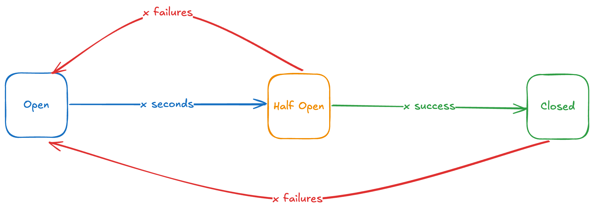

<p align="center">

<br><b>Circuit Breaker</b>
</p>
<p align="center">
<a href="https://github.com/algoyounes/circuit-breaker/actions"></a>
<a href="https://packagist.org/packages/algoyounes/circuit-breaker"></a>
<a href="https://packagist.org/packages/algoyounes/circuit-breaker"></a>
<a href="https://packagist.org/packages/algoyounes/circuit-breaker"></a>
</p>

## Motivation

The Circuit Breaker Pattern plays a vital role in ensuring the resilience of your software. It effectively stops failures from cascading, thereby preserving operational stability during service disruptions. This pattern enhances the user experience through clear visual cues, ensuring smooth application performance. Moreover, it simplifies maintenance and troubleshooting processes, facilitating faster problem resolution. Integrating the Circuit Breaker Pattern is indispensable for boosting reliability and user satisfaction.



For more info, check the official pattern doc [here](https://learn.microsoft.com/en-us/azure/architecture/patterns/circuit-breaker).

> [!NOTE]
> This package requires PHP 8.2+ and Laravel 11+ 

## Installation

You can install the package via Composer:

```bash
composer require algoyounes/circuit-breaker
```

You can publish the configuration file using the following command:

```bash
php artisan vendor:publish --provider="AlgoYounes\CircuitBreaker\Providers\CircuitBreakerServiceProvider" --tag="config"
```

## Usage

You can manage specific services with granular control using the `forService(...)` method:
```php
$circuit = $this->circuitManager->forService('service-name');
```

### Custom Callbacks
You can define callbacks for key circuit states:

- `onOpen`: Triggered when the circuit transitions to **OPEN**.
- `onHalfOpen`: Triggered when the circuit transitions to **HALF-OPEN**.
- `onClose`: Triggered when the circuit transitions to **CLOSED**.
- `onSuccess`: Triggered when a service call succeeds.
- `onFailure`: Triggered when a service call fails.
- `onSteadyState`: Triggered when the circuit is in a steady state.

Example of defining callbacks:

```php

$circuit->onOpen(function () {
    // Your custom logic here
});

$circuit->onSuccess(function () {
    // Your custom logic here
});
```

### Running an Operation

To run an operation and manage its state through the circuit breaker, use the `run` method:

```php
$circuit->run(function () {
    // Your service call here
});
```
This will execute the provided closure, applying the circuit breaker logic _(e.g., open, half-open, closed states)_ around the service call.

> [!NOTE]
> If you prefer a more direct approach, you can create a `CircuitBuilder` instance:
> ```php
> $circuit = CircuitBuilder::make('service-name')
> ```

#### Simplified Operation

For a simplified approach, use the `run` method directly from `CircuitManager`:

```php
$this->circuitManager->run('service-name', function () {
    // Your service call here
});
```

